# LightClaw

**Control local Codex and Claude coding agents from your phone via Telegram—and keep the proof of what they delivered.**

LightClaw is a self-hosted mission-control layer, not a generic remote terminal. Send a goal,
review its paths, risk, workers, and acceptance checks before execution, then receive the diff,
test evidence, artifacts, private run receipt, and scoped recovery instructions.



[Live site](https://othmaneblial.github.io/lightclaw/) · [Five-minute demo](#see-it-work-without-a-token) · [Install](docs/INSTALL.md) · [Security boundary](docs/THREAT_MODEL.md) · [Releases](https://github.com/OthmaneBlial/lightclaw/releases) · [Changelog](CHANGELOG.md)

> Alpha software with meaningful host access. Telegram access fails closed, delegated workers do not inherit provider secrets, and trusted host execution always requires per-run confirmation.

## Why LightClaw

Phone access, Telegram, diffs, and multi-agent execution already exist elsewhere. LightClaw's
narrower job is the **governed handoff**: approve a delivery contract, let bounded local workers
execute it, and judge the result from durable evidence instead of a reassuring chat summary.

| If you need… | Best fit |
|---|---|
| A live mobile terminal or full session steering | A dedicated remote-control client |
| A broad multi-channel personal assistant | A general agent gateway |
| Pre-run scope review, bounded Codex/Claude workers, acceptance checks, a patch, receipt, and undo path | **LightClaw** |

## One complete story

1. From Telegram: “Add a health check, test it, and return only verified work.”
2. LightClaw shows `builder → verifier`, requested paths, risk, and capability before execution.
3. You approve, edit, or cancel the plan.
4. Workers run in a dedicated task directory with a minimal environment.
5. LightClaw returns actual test evidence, a reviewable Git patch/branch, file hashes, a private JSON/Markdown receipt, and a scoped undo path.

That loop—not a long channel list—is the product.

## See it work without a token

The deterministic demo contacts no model and needs no Telegram account:

```bash
git clone https://github.com/OthmaneBlial/lightclaw.git
cd lightclaw
python3 -m venv .venv && . .venv/bin/activate
python -m pip install -e .
lightclaw demo
```

It replays a recorded phone request and approval, creates a disposable Git-backed Python service, runs a real unit test, and finishes with `changes.patch`, `artifact.json`, `receipt.json`, and `receipt.md`. Nothing is pushed. Try every product story:

```bash
lightclaw demo --scenario memory
lightclaw demo --scenario repo-task
lightclaw demo --scenario multi-agent
```

| Story | What it proves locally | Replay notes |
|---|---|---|
| Repository task | A real unit test, Git patch, artifact, and accepted receipt | [Exact prompt and cleanup](examples/telegram-repo-task/README.md) |
| Persistent memory | A synthetic fact survives a real SQLite restart and is recalled lexically | [Exact prompt and limits](examples/telegram-memory/README.md) |
| Multi-agent plan | Dependency order, machine-readable handoffs, visible failure, and one bounded repair | [Exact plan and limits](examples/telegram-multi-agent/README.md) |

For public, sanitized evidence that can be forked and replayed, browse the
[privacy-checked showcase](showcase/). Its three starting recipes are maintainer fixtures,
not community submissions or claims about live provider quality.

### Measured proof, not a blanket performance claim

The current full benchmark at commit [`ca1aea7`](bench/results/2026-09-01-macos-arm64-py313.json)
used macOS 26.6, Python 3.13.1, five runs, and live PyPI resolution with a potentially warm cache.

| Measurement | Result |
|---|---:|
| Base direct dependencies | 3 |
| Clean-wheel installed distributions | 10 |
| Clean-wheel install | 4.245 s |
| CLI import median | 223.499 ms |
| Lexical memory fixture | 8 / 8 top-1 |
| Orchestration fixture | 4 / 4 contracts |

These numbers describe that commit and machine. They do not predict live Telegram latency,
provider cost, model quality, or availability. Reproduce them from [`bench/`](bench/).

## LightClaw is / is not

| LightClaw is | LightClaw is not |
|---|---|
| A Telegram-first review and control surface for local coding agents | A hosted multi-tenant agent service |
| Local SQLite memory, task workspaces, receipts, and skills | Fully local inference when a hosted model is configured |
| Human approval around plans and trusted execution | A guarantee that model-generated changes are correct |
| A small Python product with optional edges | A feature-for-feature OpenClaw clone |
| Auditable fixture stories that run for $0 | Proof of real-provider latency, cost, or availability |

## Safe installation

Use an isolated tool environment and install only the SDK for the provider you
actually use. OpenAI, xAI, DeepSeek, and Z-AI share the `openai` transport extra:

```bash
pipx install 'lightclaw-ai[openai] @ git+https://github.com/OthmaneBlial/lightclaw.git'
# or
uv tool install 'lightclaw-ai[openai] @ git+https://github.com/OthmaneBlial/lightclaw.git'
```

Replace `openai` with `claude` or `gemini`, or use `providers` to install all
three SDK families. The token-free demo needs no provider extra.

Then:

```bash
lightclaw demo
lightclaw onboard --configure
lightclaw doctor
lightclaw run
```

The supported paths are app-specific:

- config: `~/.config/lightclaw/config.env` (mode `0600`);
- memory, skills, logs, and receipts: `~/.lightclaw/`;
- owned task workspaces: `~/.lightclaw/workspace/`.

Existing configuration is backed up before reset. The compatibility installer uses its own virtual environment and never installs into global Python. See [install, upgrade, undo, and uninstall](docs/INSTALL.md).

## Signature workflow

```text
Telegram text or voice goal
  -> scoped DAG with risk, paths, and expected outputs
  -> approve / edit / deny
  -> isolated Codex or Claude workers
  -> compact live progress
  -> tests + Git patch + file evidence + receipt
  -> accept / reject / selective apply / optional PR preview
```

Current capabilities include:

- fail-closed Telegram allowlisting and privileged-command rate limits;
- OpenAI, xAI, Anthropic, Gemini, DeepSeek, and Z-AI routing;
- Codex and Claude delegation profiles: `observe`, `workspace-write`, `trusted-command`;
- DAG planning, owned paths, JSON handoffs, acceptance checks, and bounded repair;
- namespaced SQLite FTS5 lexical recall with retention, export, and selective delete;
- permission-manifest skills with pinned provenance, hash review, and prompt-only activation;
- voice transcription, scheduled jobs, heartbeat, Telegram, and terminal chat;
- token-free fixture adapters used by the full CI matrix.

## Security model

An empty `TELEGRAM_ALLOWED_USERS` blocks startup. Intentionally public bots require `LIGHTCLAW_PUBLIC_BOT_ACK=yes`. Delegated processes get a minimal environment that excludes Telegram/provider keys. `lightclaw undo` refuses paths that lack a LightClaw ownership record.

These controls do not protect the host after you explicitly enable `trusted-command`, install malicious instructions, weaken an external CLI sandbox, or place secrets inside a readable task workspace.

Read [SECURITY.md](SECURITY.md) and the [threat model](docs/THREAT_MODEL.md). Report vulnerabilities through [private vulnerability reporting](https://github.com/OthmaneBlial/lightclaw/security/advisories/new), never a public issue.

## Documentation

- [Documentation map](docs/README.md) — start, operate, trust, extend, and maintain
- [Install, upgrade, undo, and uninstall](docs/INSTALL.md)
- [Architecture and enforced growth budgets](docs/ARCHITECTURE.md)
- [Run receipts and sanitized Run Cards](docs/RUN_RECEIPTS.md)
- [Threat model](docs/THREAT_MODEL.md) and [privacy boundaries](docs/PRIVACY.md)
- [Provider contract and generated compatibility evidence](docs/PROVIDERS.md)
- [Multi-agent guide](MULTI_AGENT.md) and [reproducible showcase](showcase/)
- [Roadmap](ROADMAP.md) and [evidence audit](docs/ROADMAP_AUDIT.md)

## Honest alpha limits

- Memory retrieval is bounded SQLite FTS5 lexical search, not semantic understanding. Embeddings are an optional adapter and are never required.
- Fixture demos prove LightClaw contracts, not external model quality.
- External coding-agent CLIs remain separate security boundaries with their own versions and settings.
- The package is installable from Git today; the first stable PyPI release follows the release gate in the roadmap.

## Roadmap and release state

- **Now:** make the base install smaller, keep the three fixture stories reproducible, and
  collect privacy-bounded external install evidence.
- **Next:** publish `v0.1.0`, PyPI attestations, and a versioned container only after 10–20
  external self-hosters exercise the clean install and the release gate passes.
- **Later:** improve acknowledgement/reconnect proof and real-world operator ergonomics before
  adding new channels or chasing broad assistant parity.

No stable release exists yet. The [release page](https://github.com/OthmaneBlial/lightclaw/releases),
[draft notes](docs/releases/v0.1.0.md), and [evidence-derived gate](launch/alpha/aggregate.json)
make that status explicit.

## Help qualify v0.1.0

Follow the [five-minute quickstart](docs/QUICKSTART.md), then submit the
[bounded alpha report](https://github.com/OthmaneBlial/lightclaw/issues/new?template=alpha.yml).
Never include prompts, receipts, repository content, local paths, Telegram identities, tokens,
request IDs, or screenshots. Failures and missing timings remain visible evidence.

## Community and updates

- Help qualify the first stable release through the privacy-bounded
  [external alpha report](https://github.com/OthmaneBlial/lightclaw/issues/new?template=alpha.yml).
- Follow the recurring [development updates and release evidence](https://github.com/OthmaneBlial/lightclaw/discussions/20).
- Ask support questions in [Discussions Q&A](https://github.com/OthmaneBlial/lightclaw/discussions/categories/q-a).
- Submit reproducible defects, bounded proposals, provider mismatches, or sanitized
  workflows through the structured issue forms.
- Report vulnerabilities only through [private vulnerability reporting](https://github.com/OthmaneBlial/lightclaw/security/advisories/new).

Release notes and the update thread publish fixes, workflows, benchmarks, limitations, and
explicit pauses. See the [maintenance and badge policy](docs/MAINTENANCE.md).

## Development

```bash
python3 -m venv .venv
. .venv/bin/activate
python -m pip install -e '.[dev]'
python scripts/quality.py
```

This is the canonical local quality command. The GitHub workflow runs the key-free suite on
Python 3.10–3.13 across Ubuntu and macOS, installs the wheel in a clean environment,
audits dependencies, and replays all three deterministic stories. Read
[CONTRIBUTING.md](CONTRIBUTING.md), the [support routes](SUPPORT.md), and the
[Code of Conduct](CODE_OF_CONDUCT.md) before participating.

Licensed under [MIT](LICENSE).
