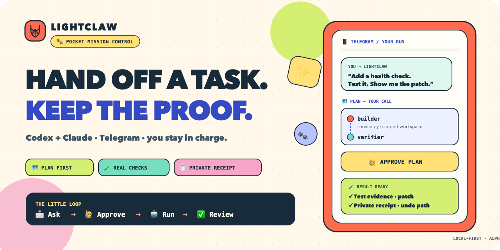

# 🐾 LightClaw

<p align="center">
  <strong>🐾 Tiny missions for local coding buddies.<br />Approve the plan. Come back to the proof. 🧾</strong>
</p>

<p align="center">
  <a href="https://othmaneblial.github.io/lightclaw/"></a>
</p>

<p align="center">
  <a href="docs/INSTALL.md"></a>
  <a href="docs/INSTALL.md"></a>
  <a href="launch/status.json"></a>
  <a href="LICENSE"></a>
</p>

<p align="center">
  <a href="https://othmaneblial.github.io/lightclaw/">🐾 Meet LightClaw</a> ·
  <a href="#-try-the-demo">🧪 Run the demo</a> ·
  <a href="docs/INSTALL.md">📦 Install</a> ·
  <a href="docs/THREAT_MODEL.md">🛡️ Security</a> ·
  <a href="CHANGELOG.md">📝 Changelog</a>
</p>

> 🚧 **Alpha software with real host access.** Telegram access fails closed. Local agents can change files. Read the [security model](docs/THREAT_MODEL.md) before connecting a bot.

## 🎯 The short version

LightClaw is a self-hosted mission desk for **Codex and Claude Code**. Toss a goal over from Telegram, check the plan, approve or tweak it, then come back to real checks, a patch, and a private receipt.

**You hold the approval button. Your local agent does the typing. The receipt keeps score.** 🧾

## 🗺️ One mission, start to finish

1. 📩 Send a text or voice goal from Telegram.
2. 👀 Review paths, risks, worker roles, and acceptance checks.
3. 🙋 Approve, edit, deny, or cancel. No approval, no run.
4. 🤖 Local Codex or Claude workers run in a bounded task workspace.
5. 🧪 Inspect real checks, a Git patch, file evidence, a private receipt, and the scoped recovery path.

Nothing is pushed for you. No approval means no delegated run. A green check is evidence about a command, not a promise that generated code is correct.

## 🧪 Try the demo

The deterministic demo needs **no Telegram account, API key, or paid model call**. It creates a disposable repo, runs a real unit test, and saves a patch plus receipts.

```bash
git clone https://github.com/OthmaneBlial/lightclaw.git
cd lightclaw
python3 -m venv .venv
. .venv/bin/activate
python -m pip install -e .
lightclaw demo
```

Pick a story:

```bash
lightclaw demo --scenario repo-task
lightclaw demo --scenario memory
lightclaw demo --scenario multi-agent
```

| 🎮 Story | 🧾 What the local replay shows |
|---|---|
| `repo-task` | A passing unit test, Git patch, artifact, and accepted receipt |
| `memory` | A synthetic fact recalled after a real SQLite restart |
| `multi-agent` | Dependency order, worker handoffs, a failed check, and one bounded repair |

These are fixture stories, not live-model benchmarks. See the [exact prompts and limits](showcase/).

## 🛠️ Install for real work

LightClaw supports **Python 3.10–3.14** on macOS and Linux. Use an isolated tool environment:

```bash
pipx install 'lightclaw-ai[openai] @ git+https://github.com/OthmaneBlial/lightclaw.git'
# or: uv tool install 'lightclaw-ai[openai] @ git+https://github.com/OthmaneBlial/lightclaw.git'
```

Replace `openai` with `claude` or `gemini`; use `providers` for all three SDK families. The demo itself needs no provider extra.

```bash
lightclaw demo
lightclaw onboard --configure
lightclaw doctor
lightclaw run
```

Your data stays in app-specific locations:

- 🔐 Config: `~/.config/lightclaw/config.env` (`0600`)
- 🧠 Memory, skills, logs, receipts: `~/.lightclaw/`
- 🧰 Owned task workspaces: `~/.lightclaw/workspace/`

See the [installation guide](docs/INSTALL.md) for Telegram bot setup, authorization, upgrades, undo, and uninstall.

## 🧩 What is in the toolbox?

- 📱 Telegram-first text and voice requests, plus terminal chat. Limits: 20 text messages and six
  voice transcriptions per Telegram user per minute.
- 🧭 Reviewed multi-agent plans with owned paths, dependencies, acceptance checks, and bounded repair.
- 🧪 Codex and Claude profiles: `observe`, `workspace-write`, and `trusted-command`.
- 🧾 Private JSON/Markdown receipts with commands, results, hashes, artifacts, and recovery context.
- 📱 Phone-friendly diff previews, full patch attachments, local accept/reject, and selective file apply.
- 🧠 Namespaced SQLite FTS5 memory and persisted summaries with 90-day default retention, export, and selective delete.
- 🧰 Permission-manifest skills, inactive by default, with provenance and hash review.
- 🔌 Provider routes for OpenAI, xAI, Anthropic, Gemini, DeepSeek, and Z-AI.

## 🛡️ Safety, without magic claims

- Telegram startup requires `TELEGRAM_ALLOWED_USERS` or explicit public mode. Allowlisted bots accept commands only in private chats because group members share session and approval state. Public group mode requires an explicit acknowledgement and no user allowlist. Local terminal chat needs no Telegram allowlist.
- Delegated workers get a minimal environment without Telegram/provider keys. Workspaces, output, callbacks, files, receipts, and SQLite permissions have explicit bounds.
- Plans and trusted runs require approval of a specific complete review; approvals expire if the clock changes or the machine sleeps. Trusted host runs show the complete task and require the requester to approve that specific review.
- **Acceptance commands run on your host and are not sandboxed by LightClaw.** Review them and use OS/container isolation for untrusted repositories.
- Secret detection is heuristic. External agent CLIs and hosted providers remain separate trust boundaries.

Read the [threat model](docs/THREAT_MODEL.md), [privacy notes](docs/PRIVACY.md), and [approval guide](docs/APPROVALS.md) before using real repositories.

## 🧭 Is it your kind of tool?

| Reach for… | When you want… |
|---|---|
| A remote-control client | A live terminal or IDE and control over every turn |
| A general agent gateway | A broad personal assistant across many channels |
| **LightClaw** | A bounded local coding task with plan approval, checks, patch, receipt, and recovery path |

LightClaw is local-first and lightweight. It is **not** a hosted multi-tenant service, fully local inference, or a guarantee that model-generated changes are correct.

## 📚 Take a look around

- 🗺️ [Docs map](docs/README.md) · [Quickstart](docs/QUICKSTART.md) · [Install and upgrade](docs/INSTALL.md)
- 🙋 [Telegram approvals](docs/APPROVALS.md) · [Job control](docs/JOB_CONTROL.md) · [Run receipts](docs/RUN_RECEIPTS.md)
- 🏗️ [Architecture](docs/ARCHITECTURE.md) · [Threat model](docs/THREAT_MODEL.md) · [Privacy](docs/PRIVACY.md)
- 🔌 [Provider support](docs/PROVIDERS.md) · [Multi-agent guide](MULTI_AGENT.md) · [Reproducible stories](showcase/)
- 🧾 [Roadmap](ROADMAP.md) · [Release evidence audit](docs/ROADMAP_AUDIT.md) · [Bench data](bench/results/)

## 🧑‍🔧 Hacking on LightClaw

```bash
python3 -m venv .venv
. .venv/bin/activate
python -m pip install -e '.[dev]'
python scripts/quality.py
```

That is the canonical local quality gate: lint, docs, architecture/runtime budgets, dependency audit, the full pytest suite, demo replays, and clean-wheel checks. **GitHub CI, CodeQL, OpenSSF Scorecard, and showcase workflows are disabled**; run the local gate before pushing.

Read [contributing](CONTRIBUTING.md), [support](SUPPORT.md), and the [Code of Conduct](CODE_OF_CONDUCT.md) before opening a ticket.

## 🌱 Alpha status

No stable release yet. The first stable release waits for real external self-hosters to try a fresh install. If you test it, send a [privacy-bounded alpha report](https://github.com/OthmaneBlial/lightclaw/issues/new?template=alpha.yml). Please leave prompts, receipts, paths, identities, and tokens out of the report.

Follow [development notes and release evidence](https://github.com/OthmaneBlial/lightclaw/discussions/20) for updates. Failures and missing timings are useful data too. 🪲

## 📄 License

[MIT](LICENSE) — bring your own bot, agents, and good judgment. 🐾
